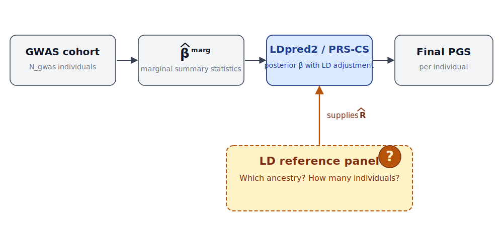
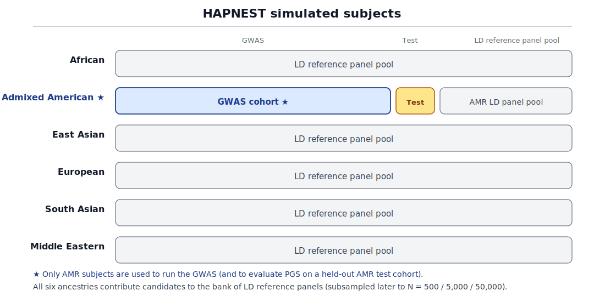

## The question

When you build a polygenic score from GWAS summary statistics,
**how much does the LD reference panel really matter?**

{fig-align="center" width="78%"}

::: {.fragment .fade-in}
Today: a simulation study across **ancestry**, **panel size**, **heritability**, and **effect sparsity**.
:::

---

## Polygenic scores  

A polygenic score (PGS) is a per-person sum of GWAS effects:

$$
\widehat{\text{PGS}}_i \;=\; \sum_{j=1}^{M} \widehat{\beta}_j \, X_{ij}
$$

- $X_{ij}$: genotype at SNP $j$ for person $i$
- $\widehat{\beta}_j$: SNP effect estimate from GWAS summary statistics
- Because nearby SNPs are correlated (LD), raw GWAS marginal effects are biased — they need to be **adjusted using an LD reference panel**.

---

## Where the LD panel enters

With standardised genotypes $\mathbf{X}$ ($N_{\text{gwas}} \times M$) and the GWAS marginal effects
$\widehat{\boldsymbol\beta}^{\text{marg}} = \tfrac{1}{N_{\text{gwas}}}\mathbf{X}^\top\mathbf{y}$,
the **summary-statistic likelihood** is

$$
\widehat{\boldsymbol\beta}^{\text{marg}} \,\big|\, \boldsymbol\beta
\;\sim\; \mathcal{N}\!\left(\mathbf{R}\,\boldsymbol\beta,\; \tfrac{1}{N_{\text{gwas}}}\mathbf{R}\right),
\qquad \mathbf{R} = \tfrac{1}{N_{\text{gwas}}}\mathbf{X}^\top\mathbf{X}.
$$

The LD matrix $\mathbf{R}$ appears in **both** the mean and the covariance — it is the *only* place individual-level data enter once we move to summary statistics.

::: {.fragment .fade-in}
Because $\mathbf{X}$ from the GWAS is unavailable, $\mathbf{R}$ is replaced by the
**estimated LD matrix** $\widehat{\mathbf{R}}$, computed from an external **reference panel**.
:::

---

## Two practical worries about the panel

::: {.columns}
::: {.column width="50%"}
### Ancestry mismatch

Public reference panels (*eg.*, 1000 Genomes) may not match the **ancestry of the GWAS cohort**.

LD patterns differ across continental populations.
:::

::: {.column width="50%"}
### Panel size

Reference panels are often **small** (hundreds to a few thousand individuals) relative to the GWAS (hundreds of thousands).

How small is "too small"?
:::
:::

---

## Research question

> **For which traits, and at what panel size, does the choice of LD reference panel actually impact PGS accuracy?**

We use a full factorial design:

- **Panel ancestry** — African, Admixed American, East Asian, European, South Asian, Middle Eastern
- **Panel size** $N \in \{500,\, 5\text{,}000,\, 50\text{,}000\}$
- **Heritability** $h^{2} \in \{0.2,\, 0.4,\, 0.6,\, 0.8\}$
- **Effect sparsity** — Gaussian (infinitesimal) vs. spike-and-slab

---

## Simulation design

{fig-align="center" width="95%"}

::: {style="font-size: 0.65em;"}
Simulated whole-genome haplotypes from HAPNEST [@wharrie2023hapnest], split into GWAS, reference panels, and test cohorts.
:::

::: {style="font-size: 0.5em;"}
Public dataset [@SophieWharrie2022]: <https://www.ebi.ac.uk/biostudies/studies/S-BSST936>
:::

---

## Simulated genotypes

{fig-align="center" width="82%"}

**HAPNEST** subjects are partitioned by ancestry: AMR is split into disjoint **GWAS / Test / panel** pools; the other five ancestries contribute LD-panel candidates only. The GWAS uses **AMR subjects only**.

---

## Simulated phenotypes

For each replicate we draw effect sizes $\beta_j$ from one of:

- **Gaussian (infinitesimal)** — every SNP contributes a small effect.
- **Spike-and-slab** — only a fraction $p_{\text{causal}}$ of SNPs are non-zero.

Then build phenotypes:

$$
y_i \;=\; \sum_j \beta_j X_{ij} + \epsilon_i, \qquad \text{Var}\!\left(\sum_j \beta_j X_{ij}\right)/\text{Var}(y_i) = h^{2}
$$

Binary traits are obtained by liability thresholding at prevalence 10% and 30%.

---

## Why sparsity matters here

::: {.columns}
::: {.column width="55%"}
- Under a **dense / infinitesimal** model, LD is averaged over many SNPs.
- Under a **sparse** model, individual SNP effects matter; correctly resolving LD around a causal variant becomes critical.

We expect panel choice to **matter most in the sparse regime**.
:::
::: {.column width="45%"}
::: {.callout-note appearance="simple"}
**Sparsity grid**

$p_{\text{causal}} \in \{0.001, 0.01, 0.05, 0.2\}$ for spike-and-slab.
:::
:::
:::

---

## Building the LD reference panels

For each ancestry and target $N$:

1. Draw $N$ individuals from the simulated population.
2. Restrict to **HapMap3** sites used by LDpred2 / PRS-CS.
3. Build LD references in each method's native format:
   - **LDpred2**: per-chromosome windowed-sparse SFBM (~3 cM window).
   - **PRS-CS**: dense within-block matrices on pre-defined LDetect blocks.

Same procedure across panels — only **who** is in the panel changes.

---

## Method 1 — LDpred2 [@prive2020ldpred2]

- Bayesian model with a **point–normal prior** on SNP effects.
- Iterates Gibbs updates of $\beta_j$ given the rest, using the estimated LD matrix $\widehat{\mathbf{R}}$ from the panel.
- We use the **auto** mode — no held-out tuning sample required.

LDpred2 is sensitive to the estimated LD matrix $\widehat{\mathbf{R}}$ because it explicitly multiplies it through every iteration.

---

## Method 2 — PRS-CS [@ge2019prscs]

- Bayesian regression with a **continuous shrinkage** prior on $\beta_j$.
- Different functional form, but also takes an estimated LD matrix $\widehat{\mathbf{R}}$ as input.
- A useful **second opinion**: do both methods agree on when the panel matters?

---

## Evaluation

For each (method, panel ancestry, panel size, $h^{2}$, sparsity) cell:

- **Quantitative trait**: out-of-sample $R^{2}$ of PGS vs. true $y$.
- **Binary trait** (prevalence 10%, 30%): out-of-sample **AUC**.

All scoring done in an **independent AMR test cohort** — disjoint from both the AMR GWAS cohort and the AMR LD-panel pool.

---

## Result 1 — R² vs panel size, LDpred2

{fig-align="center" width="78%"}

At $N = 5\text{,}000$, the matched **AMR** panel still reaches incremental $R^{2} \approx 0.55\text{–}0.75$ in the sparsest, highest-$h^{2}$ cells.

---

## Result 1 — R² vs panel size, PRS-CS

{fig-align="center" width="78%"}

Similar qualitative story under a **different prior** — supports a real effect, not a method artefact.

---

## Result 2 — Comparing incremental $R^2$ across heritability values

{fig-align="center" width="72%"}

---

## Result 3 — binary traits, prevalence 10%

{fig-align="center" width="72%"}

AUC tells the same story as $R^{2}$: ancestry matters most when **heritability is high and effects are sparse**.

---

## When the panel matters

::: {.incremental}
- **Sparse architectures**  
- **High heritability**   
- **Small panels** ($N \le 5{,}000$) — most of the size benefit is gained by $N \approx 5{,}000$.
- **Mismatched ancestry** — typically the EAS panel for an AMR target.
:::

---

## When the panel doesn't matter

::: {.incremental}
- **Infinitesimal / Gaussian** effects — all six ancestries land in the same band.  
- **Low heritability** — accuracy is floor-limited; panel choice is a second-order issue.  
- **Very large panels**    
:::

---

## Implications for practice

1. **Don't over-invest** in matched ancestry panels for highly polygenic traits — the gain is small.
2. **Do** prioritise matched ancestry when the trait is plausibly sparse and heritable (e.g. some Mendelian-adjacent quantitative traits).
3. **Budgeting**: going from $N=500$ to $N=5{,}000$ matters far more than the jump from $5{,}000$ to $50{,}000$.

---

## Limitations

- Single simulator (HAPNEST) — real LD has structure we may not reproduce.  
- "Ancestry" is treated as discrete superpopulation labels; admixed individuals deserve a finer-grained treatment.  

---

## Future work

- Add admixed and structured-population panels.
- Pair simulation results with **real GWAS** (UK Biobank, All of Us) at matched effective sample sizes.
- Extend to **multi-ancestry** PGS methods (*eg.*, PRS-CSx).

---

# Thank you!

**Frederick J. Boehm**  `frederick.boehm@sdstate.edu`

::: {.columns}
::: {.column width="50%"}
{fig-align="center" width="180"}

**GitHub repo**

:::
::: {.column width="50%"}
{fig-align="center" width="180"}

**LinkedIn**

:::
:::

::: {.fragment .fade-in}
*Questions?*
:::

---

## References {.smaller}

::: {#refs}
:::
